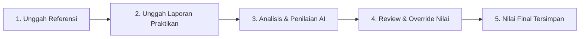

<div align="center">

# 📋 Sistem Laporan Praktikum
### *AI-Powered Lab Report Assessment System*

[](https://nextjs.org/)
[](https://www.typescriptlang.org/)
[](https://tailwindcss.com/)
[](https://www.prisma.io/)
[](https://www.sqlite.org/)

<p align="center">
  <b>Projek Pertama:</b> Platform otomasi penilaian laporan praktikum berbasis kecerdasan buatan (AI) yang dirancang khusus untuk mempermudah pekerjaan <b>Asisten Praktikum (Asprak)</b> dalam mengoreksi, mengevaluasi, dan memberikan nilai secara objektif serta transparan.
</p>

[Fitur Utama](#-fitur-utama) • [Alur Penggunaan](#-langkah-langkah-penggunaan) • [Tech Stack](#-teknologi-yang-digunakan) • [Panduan Instalasi](#-cara-menjalankan-secara-lokal)

---

</div>

## 📖 Tentang Projek

Menilai puluhan hingga ratusan laporan praktikum mahasiswa secara manual membutuhkan waktu yang sangat lama dan rentan terhadap subjektivitas. **Sistem Laporan** hadir sebagai solusi berbasis web untuk membantu asisten praktikum:

- **Bandingkan Berdasarkan Standar Acuan**: Setiap laporan praktikan dinilai secara langsung terhadap *Laporan Referensi* (kunci jawaban/standar nilai terbaik) untuk topik praktikum terkait.
- **Konsistensi Penilaian**: Menggunakan AI SDK (Google Gemini / OpenAI) dengan rubrik terstruktur sehingga standar penilaian tetap seragam untuk seluruh praktikan.
- **Human-in-the-Loop**: Asisten praktikum tetap memegang kendali penuh melalui fitur *Manual Override* untuk meninjau dan menyesuaikan skor serta feedback jika diperlukan.

---

## ✨ Fitur Utama

| Fitur | Deskripsi |
| :--- | :--- |
| 📑 **Manajemen Laporan Referensi** | Kelola laporan acuan per topik modul praktikum sebagai tolok ukur evaluasi. |
| 📁 **Dukungan Berbagai Format** | Menerima berkas laporan praktikan dalam format dokumen **PDF** (`.pdf`) dan **Word** (`.docx`). |
| 🤖 **Evaluasi Otomatis Berbasis AI** | Menganalisis kelengkapan struktur, metodologi, analisis data, hingga kesimpulan secara mendalam. |
| 🎯 **Sistem Grade & Band Nilai** | Mengelompokkan hasil nilai ke dalam predikat mutu (`A`, `AB`, `B`, `BC`, `C`, `D`, `E`). |
| ✏️ **Review & Override Asprak** | Fleksibilitas bagi asisten untuk mengedit nilai rubrik atau catatan evaluasi secara manual. |
| 🕒 **Riwayat Penilaian (History)** | Dashboard ringkas untuk memantau daftar laporan yang sudah dinilai beserta skornya. |

---

## 🚀 Langkah-langkah Penggunaan

Berikut panduan praktis alur penggunaan sistem dari awal hingga laporan selesai dinilai:



### 1. Siapkan Laporan Referensi (Kunci Acuan)
1. Buka menu navigasi **Referensi** di aplikasi.
2. Masukkan nama topik modul praktikum (contoh: *Modul 1: Jaringan Komputer*).
3. Unggah file laporan acuan yang menjadi patokan jawaban sempurna.
4. Simpan referensi. *(Tahap penilaian mahasiswa membutuhkan minimal 1 referensi aktif per topik).*

### 2. Unggah Laporan Praktikan
1. Kembali ke halaman utama (**Beri Nilai**).
2. Pilih topik praktikum yang sesuai dari dropdown.
3. Unggah satu atau beberapa file laporan mahasiswa (format `.pdf` atau `.docx`).
4. Klik tombol **Nilai Laporan**.

### 3. Tinjau Hasil Evaluasi
1. Sistem akan mengekstraksi teks dokumen dan melakukan penilaian otomatis melalui AI.
2. Pada halaman detail penilaian (`/assessment/[id]`), Anda dapat melihat:
   - **Skor Total & Grade Band**
   - **Rincian Rubrik Penilaian** (Poin per kriteria)
   - **Kelebihan & Kekurangan** laporan praktikan
   - **Saran Perbaikan** untuk mahasiswa

### 4. Sesuaikan Nilai (Opsional)
- Jika ada poin yang perlu dikoreksi berdasarkan kebijakan laboratorium, asisten praktikum dapat menggunakan formulir **Override Nilai** di bagian bawah laporan.

---

## 🛠️ Teknologi yang Digunakan

- **Framework**: [Next.js](https://nextjs.org/) (App Router, Server Components & Server Actions)
- **Bahasa**: [TypeScript](https://www.typescriptlang.org/)
- **Styling**: [Tailwind CSS v4](https://tailwindcss.com/)
- **Database & ORM**: [Prisma ORM](https://www.prisma.io/) dengan SQLite (`better-sqlite3`)
- **AI Integration**: [Vercel AI SDK](https://sdk.vercel.ai/) (`@ai-sdk/google`, `@ai-sdk/openai`)
- **Document Parsers**: `mammoth` (DOCX parsing) & `pdf-parse` (PDF extraction)

---

## 💻 Cara Menjalankan Secara Lokal

Ikuti langkah-langkah berikut untuk menjalankan projek di komputer Anda:

### 1. Clone Repository
```bash
git clone https://github.com/rafinax48/Sistem-Laporan.git
cd Sistem-Laporan
```

### 2. Install Dependensi
```bash
npm install
```

### 3. Konfigurasi Environment Variables
Salin file `.env.example` menjadi `.env.local` atau `.env`:
```bash
cp .env.example .env.local
```
Sesuaikan konfigurasi AI gateway (menggunakan 9Router lokal di port 20128 secara default):
```env
DATABASE_URL="file:./data/app.db"
NINEROUTER_API_KEY="kunci_api_9router_anda"
NINEROUTER_BASE_URL="http://127.0.0.1:20128/v1"
NINEROUTER_MODEL_ID="gemini/gemini-3.5-flash-lite"
```

### 4. Setup Database
Inisialisasi database SQLite dan jalankan push/migrasi Prisma:
```bash
npx prisma db push
```

### 5. Jalankan AI Gateway (9Router) & Server Development
Jalankan gateway AI di background:
```bash
npm run router
# atau jalankan '9router' langsung di terminal
```

Lalu jalankan server aplikasi Next.js:
```bash
npm run dev
```
Buka browser dan akses [http://localhost:3000](http://localhost:3000).

---

## 👨‍💻 Pengembang

**Projek Pertama oleh:**
- **GitHub**: [@rafinax48](https://github.com/rafinax48)
- **Institusi**: Mata Kuliah Semester 5

---

<div align="center">
  <sub>Dibuat dengan ❤️ untuk kemudahan asisten praktikum dan mahasiswa.</sub>
</div>
