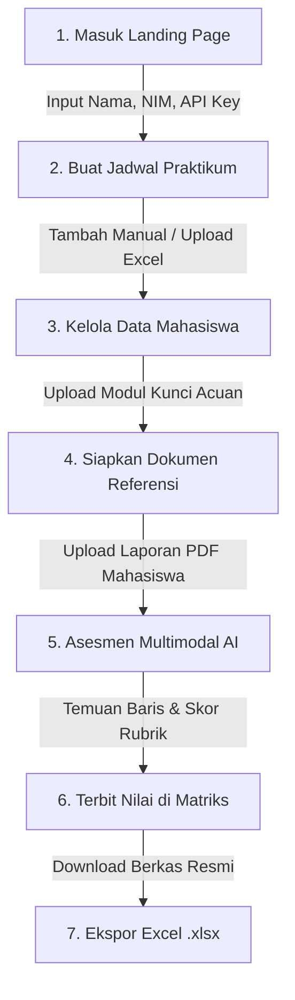

<div align="center">

# 📋 Sistem Asesmen & Buku Nilai Laporan Praktikum
### *AI-Powered Multimodal Report Assessment & Gradebook System*
**Laboratorium Teknik Informatika · Fakultas Teknologi Industri · Universitas Ahmad Dahlan**

[](https://nextjs.org/)
[](https://react.dev/)
[](https://www.typescriptlang.org/)
[](https://tailwindcss.com/)
[](https://www.prisma.io/)
[](https://www.sqlite.org/)
[](https://aistudio.google.com/)

<p align="center">
  Platform otomasi asesmen laporan praktikum berbasis kecerdasan buatan multimodal (AI Vision) yang terintegrasi dengan <b>Buku Nilai Matriks Sesi Pertemuan</b>. Membantu <b>Dosen</b> dan <b>Asisten Praktikum (Asprak)</b> dalam mengoreksi, mengevaluasi isi &amp; tangkapan layar praktikum, menemukan titik baris kesalahan dokumen, serta merekap nilai secara objektif dan transparan berstandar rubrik akademik UAD.
</p>

[Fitur Unggulan](#-fitur-unggulan) • [Prasyarat](#-prasyarat-sistem) • [Panduan Instalasi](#-panduan-instalasi-di-github) • [Konfigurasi API Key](#-konfigurasi-gemini-api-key) • [Alur Penggunaan](#-alur-penggunaan-sistem) • [Struktur Proyek](#-struktur-proyek)

---

</div>

## 📖 Tentang Sistem

Mengevaluasi ratusan berkas laporan praktikum mahasiswa setiap minggunya menuntut ketelitian tinggi, terutama dalam memeriksa kebenaran kode program, ketepatan analisis data, dan keaslian tangkapan layar output praktikum. **Sistem Laporan Praktikum UAD** hadir sebagai solusi berbasis web generasi baru yang menggabungkan:

1. **Evaluasi Multimodal Vision**: Model AI membaca isi teks bernomor baris sekaligus membedah visual dokumen (tangkapan layar terminal, grafik, skema diagram) untuk memastikan laporan dikerjakan sesuai modul acuan.
2. **Deteksi Baris & Halaman Presisi**: AI tidak hanya memberikan skor, namun merinci letak halaman, bab, perkiraan nomor baris, kutipan kalimat yang keliru, dan saran perbaikan langsung.
3. **Buku Nilai Matriks Ala Excel**: Nilai mahasiswa otomatis terpetakan pada kolom pertemuan (P01–P08/Pn) dan dapat diekspor langsung ke format resmi Microsoft Excel (`.xlsx`) dalam satu klik.
4. **Arsitektur Halaman Khusus Terisolasi**: Setiap mata kuliah praktikum memiliki URL tersendiri (`/practicums/[id]`) dengan sub-halaman terpisah untuk Buku Nilai, Manajemen Praktikan, Penilaian Laporan, dan Pengaturan.

---

## ✨ Fitur Unggulan

| Fitur | Deskripsi |
| :--- | :--- |
| 🏠 **Landing Page Onboarding** | Halaman selamat datang dengan form input **Nama**, **NIM**, dan **Gemini API Key**, penguji koneksi API instan, serta integrasi profil ke seluruh sistem. |
| 📊 **Buku Nilai Matriks Pertemuan** | Lembar rekapitulasi nilai dinamis P01 s/d Pn per mahasiswa, filter kelas (A/B/C), metrik KPI rata-rata kelas, dan ekspor berkas Excel resmi. |
| 📑 **Halaman Khusus Praktikum** | Tiap praktikum memiliki halamannya sendiri di `/practicums/[id]` dengan sub-navigasi tab terpisah (Buku Nilai, Praktikan, Penilaian, Pengaturan). |
| 👥 **Kelola Praktikan Cerdas** | Tambah praktikan manual, impor berkas massal via Excel/CSV/SVG dengan deteksi kolom otomatis, koreksi data, serta hapus satuan dan massal. |
| 🗑️ **Zona Bahaya & Hapus Aman** | Fitur hapus mata kuliah praktikum dengan konfirmasi ketik nama dan penghapusan data bertingkat (*cascading cleanup*) yang aman. |
| 👁️ **Multimodal AI Gemini** | Menganalisis dokumen format PDF (`.pdf`) dan Word (`.docx`) menggunakan Gemini 1.5/2.5 Flash berstandar rubrik acuan. |
| 📍 **Temuan Baris Dokumen (Findings)** | Melacak letak kesalahan mahasiswa lengkap dengan nomor halaman, seksi/bab, nomor baris `[H1:L1]`, kutipan teks, dan saran perbaikan. |
| ⚖️ **Rubrik Baku Akademik UAD** | Penilaian terukur 3 kategori: **Kelengkapan Struktur**, **Kebenaran Isi**, dan **Kedalaman Analisis** (Skala 0–100 & Predikat Band Mutu). |
| 🔄 **Alur Revisi Laporan** | Praktikan dapat mengunggah perbaikan laporan pada pertemuan yang sama tanpa merusak integritas data matriks. |

---

## 💻 Prasyarat Sistem

Sebelum memulai instalasi, pastikan perangkat komputer Anda telah terpasang:

- **Node.js**: Versi **18.18.0** ke atas atau **20.x LTS** (Disarankan Node.js 20+).
  - Cek versi: `node -v`
- **NPM**: Versi **9.x** atau **10.x** (Bawaan Node.js).
  - Cek versi: `npm -v`
- **Git**: Untuk mengunduh repository dari GitHub.
  - Cek versi: `git --version`
- **Google Gemini API Key**: Kunci API gratis dari [Google AI Studio](https://aistudio.google.com/app/apikey).

---

## 🚀 Panduan Instalasi di GitHub

Ikuti langkah-langkah berikut secara berurutan untuk menjalankan sistem di komputer lokal Anda:

### 1. Clone Repository dari GitHub

Buka terminal (PowerShell, Command Prompt, atau Terminal Linux/macOS), lalu jalankan:

```bash
git clone https://github.com/rafinax48/Sistem-Laporan.git
cd Sistem-Laporan
```

### 2. Pasang Dependensi Proyek

Jalankan perintah instalasi paket modul Node.js:

```bash
npm install
```

> **Catatan:** Perintah `postinstall` akan secara otomatis menjalankan `prisma generate` untuk membangun client database SQLite.

### 3. Konfigurasi Environment File (`.env.local`)

Salin berkas contoh konfigurasi `.env.example` menjadi `.env.local` dan `.env`:

**Windows (PowerShell):**
```powershell
Copy-Item .env.example .env.local
Copy-Item .env.example .env
```

**Linux / macOS / Git Bash:**
```bash
cp .env.example .env.local
cp .env.example .env
```

Isi berkas `.env.local` Anda seperti berikut:
```env
# Koneksi Database SQLite Lokal
DATABASE_URL="file:./data/app.db"

# Kunci API Google Gemini (Dapat diisi di sini atau langsung lewat Landing Page web)
GEMINI_API_KEY="AIzaSy_masukkan_kunci_anda_di_sini"

# Konfigurasi AI Gateway (Opsional - default port jika menggunakan 9Router)
NINEROUTER_API_KEY="sk-e318a1c54061784e-5vo9dy-c115e232"
NINEROUTER_BASE_URL="http://127.0.0.1:20128/v1"
NINEROUTER_MODEL_ID="gemini/gemini-3.5-flash-lite"
```

### 4. Inisialisasi Database SQLite & Skema Prisma

Jalankan sinkronisasi skema database ke SQLite:

```bash
npx prisma db push
```

Perintah ini akan membuat berkas database SQLite di folder `data/app.db` beserta seluruh tabel (`Practicum`, `Student`, `Report`, `Assessment`, `AssessmentCategory`, `AssessmentFinding`).

### 5. Jalankan Server Aplikasi Next.js

Mulai server lokal dalam mode development:

```bash
npm run dev
```

Tunggu hingga terminal menampilkan pesan:
```text
▲ Next.js 16.3.0 (Turbopack)
- Local: http://localhost:3000
✓ Ready in 2.5s
```

Buka peramban (browser) Anda dan akses:
👉 **[http://localhost:3000](http://localhost:3000)**

---

## 🔑 Konfigurasi Gemini API Key

Sistem menyediakan **3 opsi fleksibel** untuk menghubungkan kunci API Gemini:

### Opsi A: Melalui Landing Page Web (Paling Mudah & Disarankan) 🌟
1. Buka `http://localhost:3000/`.
2. Pada kartu **Portal Akses Mahasiswa & Asisten**, masukkan:
   - **Nama Lengkap**: Nama Anda.
   - **NIM**: Nomor Induk Mahasiswa Anda (cth. `2200018215`).
   - **Gemini API Key**: Tempelkan kunci API yang diawali `AIzaSy...`.
3. Klik tombol **"Uji"** untuk memverifikasi keaktifan kunci secara instan.
4. Klik **"Simpan & Lanjut ke Dashboard"**. Kunci tersimpan aman di peramban Anda dan otomatis digunakan pada setiap penilaian.

### Opsi B: Melalui File `.env.local`
Masukkan kunci API Anda pada baris `GEMINI_API_KEY` di file `.env.local`:
```env
GEMINI_API_KEY="AIzaSyxxxxxxxxxxxxxxxxxxxxxxxxxxxxxxx"
```
Server akan menggunakannya sebagai fallback utama untuk seluruh evaluasi.

### Cara Mendapatkan Kunci Gemini Gratis (1 Menit):
1. Buka [https://aistudio.google.com/app/apikey](https://aistudio.google.com/app/apikey).
2. Masuk menggunakan akun Google Anda (email UAD atau Gmail).
3. Klik tombol **"Create API key"**.
4. Salin kode kunci yang diberikan dan tempelkan ke aplikasi.

---

## 🔄 Alur Penggunaan Sistem

Berikut alur kerja praktikum dari awal hingga rekapitulasi nilai selesai:



1. **Identitas & Kunci AI**: Buka Beranda (`/`), masukkan Nama, NIM, dan API Key Anda.
2. **Jadwal Praktikum**: Masuk ke menu **Jadwal & Praktikan** (`/practicums`), buat mata kuliah praktikum baru (cth: *Praktikum Grafika Komputer - Slot A*).
3. **Impor Praktikan**: Buka praktikum tersebut, pilih tab **Data Praktikan** (`/practicums/[id]/students`). Tambahkan mahasiswa atau lampirkan berkas Excel/CSV kelas.
4. **Unggah Referensi Acuan**: Masuk ke menu **Referensi** (`/reference`), unggah berkas kunci jawaban/laporan sempurna untuk topik modul praktikum tersebut.
5. **Nilai Laporan Praktikan**: Buka tab **Penilaian Laporan** (`/practicums/[id]/assess`) atau klik tombol **+ Input Laporan** langsung pada sel Buku Nilai di dashboard.
6. **Periksa Temuan & Terbitkan Nilai**: AI akan mengevaluasi berkas, memeriksa tangkapan layar, menemukan baris kesalahan, dan menyimpan skor ke matriks.
7. **Ekspor Nilai**: Klik tombol **Ekspor Rekap Excel** di halaman Buku Nilai untuk mengunduh berkas `.xlsx` resmi laboratorium.

---

## 📁 Struktur Proyek

```text
Sistem-Laporan/
├── app/
│   ├── api/
│   │   ├── assess/route.ts              # API utama penilaian laporan multimodal AI
│   │   ├── auth/validate-key/route.ts   # API pengujian keaktifan API Key Gemini
│   │   ├── practicums/                  # API CRUD praktikum, mahasiswa, & matriks
│   │   └── reference/route.ts           # API unggah & daftar laporan referensi
│   ├── components/
│   │   ├── assessment-matrix.tsx        # Komponen Buku Nilai Matriks & Ekspor Excel
│   │   ├── home-matrix-view.tsx         # Tampilan matriks di dashboard utama
│   │   ├── landing-view.tsx             # Komponen Landing Page & Onboarding profil
│   │   ├── practicum-manager.tsx        # Kartu praktikum dengan aksi langsung
│   │   ├── student-manager.tsx          # Tabel mahasiswa, impor Excel, & hapus massal
│   │   ├── upload-form.tsx              # Form unggah penilaian mandiri
│   │   └── user-header-profile.tsx      # Indikator profil pengguna di bilah navigasi
│   ├── dashboard/page.tsx               # Halaman Buku Nilai (Gradebook Overview)
│   ├── history/page.tsx                 # Halaman riwayat evaluasi seluruh laporan
│   ├── landing/page.tsx                 # Rute alternatif Landing Page
│   ├── practicums/
│   │   ├── page.tsx                     # Daftar seluruh jadwal praktikum aktif
│   │   └── [id]/
│   │       ├── layout.tsx               # Header institusional & tab navigasi praktikum
│   │       ├── page.tsx                 # Sub-halaman 1: Buku Nilai (Matriks P01-Pn)
│   │       ├── students/page.tsx        # Sub-halaman 2: Kelola Data Praktikan
│   │       ├── assess/page.tsx          # Sub-halaman 3: Penilaian Laporan Praktikum
│   │       └── settings/page.tsx        # Sub-halaman 4: Pengaturan & Zona Bahaya
│   ├── reference/page.tsx               # Halaman kelola dokumen acuan/referensi
│   ├── layout.tsx                       # Layout global root & header navigasi UAD
│   └── page.tsx                         # Halaman utama root (Landing Page)
├── lib/
│   ├── assess.ts                        # Engine penilaian rubrik AI Gemini Multimodal
│   ├── db.ts                            # Koneksi singleton client Prisma SQLite
│   ├── env.ts                           # Validasi environment & router config
│   ├── parse.ts                         # Parser PDF bernomor baris & rendering PNG
│   ├── student-importer.ts              # Normalisasi NIM, nama, & parsing Excel/CSV
│   ├── types.ts                         # Definisi tipe TypeScript & Zod schemas
│   └── user-profile.ts                  # State manager profil (localStorage & cookies)
├── prisma/
│   └── schema.prisma                    # Skema model database SQLite
├── scripts/
│   └── test/band.test.ts                # Unit testing rubrik & predikat skor band
├── package.json                         # Dependensi dan skrip proyek
└── README.md                            # Panduan dokumentasi proyek
```

---

## 🛠️ Daftar Perintah (NPM Scripts)

| Perintah | Deskripsi |
| :--- | :--- |
| `npm run dev` | Menjalankan server development Next.js dengan Turbopack (`http://localhost:3000`). |
| `npm run build` | Melakukan kompilasi dan build aplikasi untuk deployment production. |
| `npm run start` | Menjalankan server hasil build production. |
| `npm run typecheck` | Menjalankan pengecekan tipe statis TypeScript (`tsc --noEmit`). |
| `npm test` | Menjalankan unit test perhitungan skor rubrik dan band nilai. |
| `npx prisma db push` | Menyinkronkan perubahan skema `schema.prisma` ke database SQLite lokal. |
| `npx prisma studio` | Membuka antarmuka grafis web untuk melihat dan mengedit isi tabel database. |

---

## ❓ Tanya Jawab & Solusi Kendala (FAQ & Troubleshooting)

<details>
<summary><b>1. Port 3000 sudah digunakan (Error: Port 3000 is already in use)</b></summary>
<br>
Jika port 3000 sedang dipakai proses lain, Anda dapat mematikan proses tersebut atau menjalankan Next.js di port lain:

```bash
npm run dev -- -p 3001
```
Lalu buka `http://localhost:3001` di peramban Anda.
</details>

<details>
<summary><b>2. Error "PrismaClientInitializationError: Unable to open database file"</b></summary>
<br>
Pastikan direktori `data` sudah ada di root proyek Anda, lalu jalankan sinkronisasi database:

```bash
mkdir data
npx prisma db push
```
</details>

<details>
<summary><b>3. Muncul error kuota API Key Gemini (RESOURCE_EXHAUSTED / 429)</b></summary>
<br>
Sistem telah dilengkapi exponential backoff retry otomatis. Jika kuota gratis akun Google Anda habis sementara:
1. Buka [Google AI Studio](https://aistudio.google.com/app/apikey) dan buat API Key baru dengan akun Google lain.
2. Buka Landing Page di `http://localhost:3000/`, klik **"Ganti Akun / API Key"**, dan masukkan kunci baru tersebut.
</details>

<details>
<summary><b>4. Bagaimana cara mereset seluruh database jika ingin mulai dari nol?</b></summary>
<br>
Jalankan perintah reset database Prisma:

```bash
npm run db:reset
```
*Peringatan: Seluruh data praktikum, praktikan, dan laporan akan dihapus dan skema akan dibangun ulang.*
</details>

---

## 👨‍💻 Pengembang & Kontributor

- **Pengembang Utama**: [@rafinax48](https://github.com/rafinax48)
- **Afiliasi**: Program Studi Teknik Informatika, Fakultas Teknologi Industri, Universitas Ahmad Dahlan (UAD)

---

<div align="center">
  <sub>Didedikasikan untuk kemajuan praktikum dan mutu pendidikan di Laboratorium Teknik Informatika Universitas Ahmad Dahlan.</sub>
</div>
